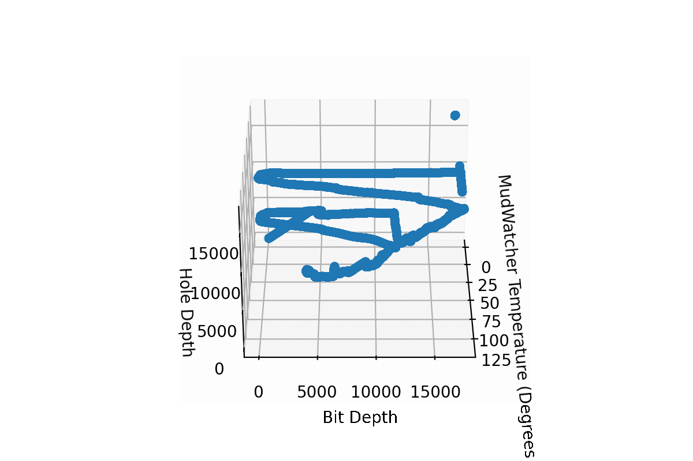

# mud-properties-prediction

In this project the properties of the drilling mud are assessed for real-time prediction from the knowledge of the system variables such as hole deep, pressure, etc. Only results are shared here, not the data.

Notebook `` shows an exploration of the values and relationship between mud properties and system variables. Of note, this notebook has the code to generate animated 3D plots 

